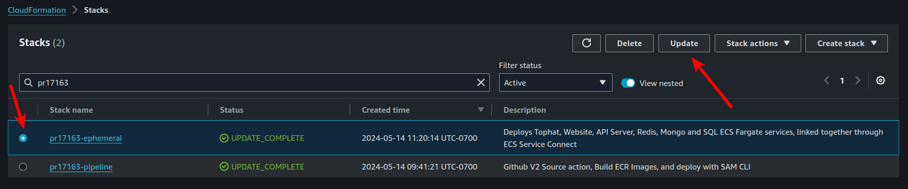
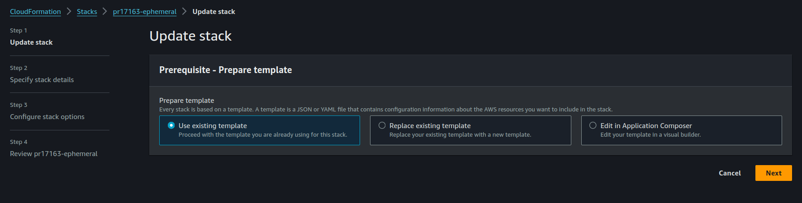
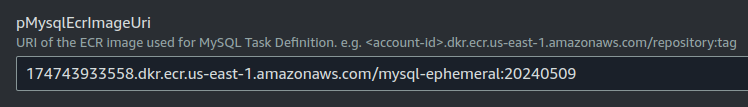
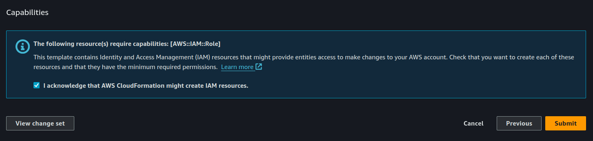

# Deployment order (CodePipeline CodeBuild, not for Standalone CodeBuild)

### Deploy ECR repos

```bash
sam build -t ecr.yml
```


```bash
sam deploy -t ecr.yml --config-env ecr --parameter-overrides "pAppName=pr1" --stack-name pr1-ecr --tags CleanupDate=$(date -u -d "+10 days" '+%Y-%m-%dT%H:%M:%SZ') --no-confirm-changeset
```


### Build and push Docker Images to the ECR repos

```bash
aws ecr get-login-password --region us-east-1 | docker login --username AWS --password-stdin 174743933558.dkr.ecr.us-east-1.amazonaws.com 
```

```bash
docker build -f docker-flask-frontend/Dockerfile -t 174743933558.dkr.ecr.us-east-1.amazonaws.com/website-pr1:latest ./docker-flask-frontend/  
```

```bash
docker push 174743933558.dkr.ecr.us-east-1.amazonaws.com/website-pr1:latest
```


### Deploy Main Infra

```bash
sam build -t madisonreed-ephemeral-tester.yml
```


```bash
sam deploy -t ecs/madisonreed-ecs-tester.yml \
  --resolve-s3 \
  --capabilities CAPABILITY_NAMED_IAM \
  --parameter-overrides \
    "pAppName=pr1 \
     pVpcId=vpc-09ef4a53e9290ca17 \
     pPrivateSubnetId1=subnet-01086857935bfcf34 \ 
     pPrivateSubnetId2=subnet-056e57e04fea05dd5 \
     pPublicSubnetId1=subnet-0598f465e77230bd5 \
     pPublicSubnetId2=subnet-0d650820a97fa5ba3 \
     pR53HostedZoneId=Z0323068C9DQS081P13G \
     pWebsiteEcrImageUri=174743933558.dkr.ecr.us-east-1.amazonaws.com/connectiontest:latest \
     pACMCertificateArn=arn:aws:acm:us-east-1:174743933558:certificate/07f48ca4-3dcf-4ed7-b4df-147b3412be62 \
     pColorAdvisorApiUrl=test" \
  --stack-name pr1-ephemeral \
  --tags CleanupDate=$(date -u -d "+10 days" '+%Y-%m-%dT%H:%M:%SZ') \
  --no-confirm-changeset \
  --on-failure DELETE
```


### Update ECS service when a change is made:

```bash
aws ecs update-service --cluster pr1-cluster --service pr1-frontend --force-new-deployment
```


### Cleanup
```bash
# Sam delete waits until the stack is fully deleted before moving to the next line. To use async deletion, try cloudformation
sam delete --stack-name pr1-ephemeral --no-prompts
sam delete --stack-name pr1-ecr --no-prompts


aws cloudformation delete-stack --stack-name pr1-ephemeral
```


# Standalone CodeBuild (Triggered by Github Actions)


### Deploy CodePipeline, CodeBuild template.
Variables are pulled from build project environment vars

```bash
sam build -t pipeline.yml
```


```bash
sam deploy -t pipeline.yml --config-env pipeline --parameter-overrides "pAppName=${PR_ID}" --stack-name pr1-pipeline --tags CleanupDate=$(date -u -d "+10 days" '+%Y-%m-%dT%H:%M:%SZ') --no-confirm-changeset
```

###  Start Codepipeline, passing variables from Github Actions:
```bash
aws codepipeline start-pipeline-execution --name ${PR_ID}-pipeline --variables name=PR_ID,value=123 name=PR_EVENT,value=closed
```


# Deploy nested stacks
sam deploy -t root.yml \
  --config-env ephemeral \
  --parameter-overrides \
    "pAppName=pr1test \
     pVpcId=vpc-09ef4a53e9290ca17 \
     pPrivateSubnetId1=subnet-01086857935bfcf34 \ 
     pPrivateSubnetId2=subnet-056e57e04fea05dd5 \
     pPublicSubnetId1=subnet-0598f465e77230bd5 \
     pPublicSubnetId2=subnet-0d650820a97fa5ba3 \
     pR53HostedZoneId=Z0323068C9DQS081P13G, \
     pACMCertificateArn=arn:aws:acm:us-east-1:174743933558:certificate/07f48ca4-3dcf-4ed7-b4df-147b3412be62" \
     pWebsiteEcrImageUri=174743933558.dkr.ecr.us-east-1.amazonaws.com/connectiontest:latest \
     pNodeEnv=development \
     pEpsagonToken="-" \
  --stack-name pr1test-ephemeral \
  --tags CleanupDate=$(date -u -d "+10 days" '+%Y-%m-%dT%H:%M:%SZ')


# INFORMATIONAL
#### Notable files to be aware of:
* **.github/workflows/ephemeral-envs.yml** - Github Action for deploying CodePipeline ephemeral deployment pipeline.
* **ephemeralenv/** - contains IaC and buildspec code for Ephemeral environments.
* **ephemeralenv/pipeline.yml** - Github Action uses SAM CLI to deploy this stack when a PR is made into a branch that contains the `ephemeral-envs.yml` github action config and the branch matches the criteria needed to trigger the workflow.

* **ephemeralenv/root.yml** - Nested Stack template used to link dependency of API and ECS child stacks, while also improving maintainability for the SAM Application.
* **ephemeralenv/ecs/** - Contains child template configuration for CodeBuild to deploy ECS components.
* **ephemeralenv/api/** - Contains child template configuration for CodeBuild to deploy Color Advisor API components.


# DOCUMENTATION

# Automated Deployment via GitHub Actions

Ephemeral environments are automatically deployed through a GitHub Action workflow. The process involves:

1. **Triggering the Workflow**: The workflow is triggered by pull request events (opened, synchronized, reopened, closed) for branches that start with `c303`.

2. **Pipeline Deployment**: The `pipeline.yml` file is used to create an AWS CodePipeline. This pipeline orchestrates the build and deployment process for all the ECS services and CloudFormation Infrastructure.

3. **Build and Deployment**: The pipeline triggers various CodeBuild projects using the respective `buildspec` files located in this folder. These buildspec files define the steps to build the Docker images and deploy the infrastructure.

4. **Infrastructure Deployment**: The infrastructure is deployed using AWS SAM CLI and CloudFormation templates, specifically the `ecs/madisonreed-ServiceConnect-ALB.yml` file.

### Key Files
* `.github/workflows/ephemeral-envs.yml`: Defines the GitHub Action workflow.
* `pipeline.yml`: Defines the AWS CodePipeline and associated resources.
* `buildspec-*.yml`: Defines the build and deployment steps for different services that the CodePipeline's CodeBuild projects use for updating the environment.
* `madisonreed-ServiceConnect-ALB.yml`: CloudFormation template for deploying the ECS infrastructure. This is deployed via the script defined in `buildspec-deploy.yml`


# Specifying MySQL and Mongo dump
When a Pull Request is opened, the environment that gets deployed will use the most recent Mongo and MySQL dumps. These dumps are created once per day at 4:59 PM PST from the CI scripts located in [/ephemeralenv/database/mongo](/database/mongo/) and [/ephemeralenv/database/mysql](/database/mysql/)


The dump used wont change when new commits are made. If you want to use an older or newer dump, you have to specify this manually from the CloudFormation console.

To modify the dump version used, navigate to the [AWS CloudFormation](https://us-east-1.console.aws.amazon.com/cloudformation/home?region=us-east-1) console.

1. Search for your Pull Request infrastructure by typing in `pr123456` into the search filter. (replace 123456 with your Pull Request ID)
2. Select the Radio Button next to the `pr123456-ephemeral` CloudFormation stack name and click the `Update` Button.
<p align="center">
  
</p>

3. Select `Use existing template` and click next.
<p align="center">
  
</p>

4. Look for the `pMysqlEcrImageUri` parameter and modify the date tag to match the dump date that you want to use. (In this case, the dump used will be the dump created on `20240509`)
<p align="center">
  
</p>

> [!NOTE] 
You can find the available dump dates that you can use by navigating to the respective ECR Repository in the ECR AWS console using the links below.

[ECR MySQL](https://us-east-1.console.aws.amazon.com/ecr/repositories/private/174743933558/mysql-ephemeral?region=us-east-1)

[ECR Mongo](https://us-east-1.console.aws.amazon.com/ecr/repositories/private/174743933558/mongo-ephemeral?region=us-east-1)

5. Click `Next`, and click `Next` again on the `Configure stack options` page and finally on the `Review` steps page.
6. Scroll to the bottom of the page and select the acknowledgement checkbox and click `Submit`. The stack should enter an `UPDATE` state. Once it reaches `UPDATE_COMPLETE`, the environment should now be using the specified Mongo/MySQL dump.

<p align="center">
  
</p>