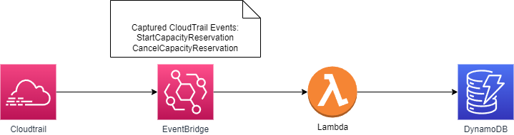

# odcr-history-dynamodb


## Architecure Diagram
<p align="center">
  
</p>

This SAM template will deploy and update the `"odcr-history"` DynamoDB table located in the Region this stack is deployed in with details containing `EC2 On Demand Capacity Reservations` created in the past 90 days and any new Reservations created after the stack is created.

## Project File Structure
This project contains source code and supporting files for a serverless application that you can deploy with the SAM CLI. It includes the following files and folders:

- cloudtrailToDynamoFunction - Code for the `Lambda` custom resource, which pushes to DynamoDB the `On Demand Capacity Reservation` events that happened **before** deploying the stack
- odcrEventsToDynamoFunction - Code for the Lambda function triggered by EventBridge, which pushes **new** CapacityReservation events to DyanmoDB
- events - Invocation events that you can use to invoke the function with `sam local invoke event/<event-name.json>`
- tests - Unit tests for the application code. 
- template.yaml - A template that defines the application's AWS resources.

Resources are defined in the `template.yaml` file in this project.


## Deploy the application

The Serverless Application Model Command Line Interface (SAM CLI) is an extension of the AWS CLI that adds functionality for building and testing Lambda applications. It uses Docker to run your functions in an Amazon Linux environment that matches Lambda. It can also emulate your application's build environment and API.

To use the SAM CLI, you need the following tools.

* SAM CLI - [Install the SAM CLI](https://docs.aws.amazon.com/serverless-application-model/latest/developerguide/serverless-sam-cli-install.html)
* [Python 3 installed](https://www.python.org/downloads/)
* Docker - [Install Docker community edition](https://hub.docker.com/search/?type=edition&offering=community)

To build and deploy the application for the first time, run the following commands:

```bash
sam build --use-container
sam deploy --guided
```

The first command will build the source of your application. The second command will package and deploy your application to AWS, with a series of prompts:

* **Stack Name**: The name of the stack to deploy to CloudFormation. This should be unique to your account and region, and a good starting point would be something matching your project name.
* **AWS Region**: The AWS region you want to deploy your app to.
* **Confirm changes before deploy**: If set to yes, any change sets will be shown to you before execution for manual review. If set to no, the AWS SAM CLI will automatically deploy application changes.
* **Allow SAM CLI IAM role creation**: Many AWS SAM templates, including this example, create AWS IAM roles required for the AWS Lambda function(s) included to access AWS services. By default, these are scoped down to minimum required permissions. To deploy an AWS CloudFormation stack which creates or modifies IAM roles, the `CAPABILITY_IAM` value for `capabilities` must be provided. If permission isn't provided through this prompt, to deploy this example you must explicitly pass `--capabilities CAPABILITY_IAM` to the `sam deploy` command.
* **Save arguments to samconfig.toml**: If set to yes, your choices will be saved to a configuration file inside the project, so that in the future you can just re-run `sam deploy` without parameters to deploy changes to your application.

## Use the SAM CLI to build and test locally

Build the application with the `sam build --use-container` command.

```bash
odcr-history-dynamodb$ sam build --use-container
```

The SAM CLI installs dependencies defined in `odcrEventsToDynamoFunction/requirements.txt`, creates a deployment package, and saves it in the `.aws-sam/build` folder.

Test a single function by invoking it directly with a test event. An event is a JSON document that represents the input that the function receives from the event source. Test events are included in the `events` folder in this project.

Run functions locally and invoke them with the `sam local invoke` command.

### Example:
```bash
odcr-history-dynamodb$ sam local invoke odcrEventsToDynamoFunction --event events/createCapacityReservation-limited.json
```

## Fetch, tail, and filter Lambda function logs

To simplify troubleshooting, SAM CLI has a command called `sam logs`. `sam logs` lets you fetch logs generated by your deployed Lambda function from the command line. In addition to printing the logs on the terminal, this command has several nifty features to help you quickly find the bug.

| `NOTE`: This command works for all AWS Lambda functions; not just the ones you deploy using SAM.

```bash
odcr-history-dynamodb$ sam logs -n odcrEventsToDynamoFunction --stack-name odcr-history-dynamodb --tail
```

You can find more information and examples about filtering Lambda function logs in the [SAM CLI Documentation](https://docs.aws.amazon.com/serverless-application-model/latest/developerguide/serverless-sam-cli-logging.html).

## Tests

Tests are defined in the `tests` folder in this project. Use PIP to install the test dependencies and run tests.

```bash
odcr-history-dynamodb$ pip install -r tests/requirements.txt --user
# unit test
odcr-history-dynamodb$ python -m pytest tests/unit -v

# integration test, requiring deploying the stack first.
# Create the env variable AWS_SAM_STACK_NAME with the name of the stack we are testing
odcr-history-dynamodb$ AWS_SAM_STACK_NAME=<stack-name> python -m pytest tests/integration -v
```

## Cleanup

To delete the stack that you created, use the AWS CLI. Assuming you used the project name for the stack name, you can run the following:

```bash
aws cloudformation delete-stack --stack-name odcr-history-dynamodb
```

## Resources

See the [AWS SAM developer guide](https://docs.aws.amazon.com/serverless-application-model/latest/developerguide/what-is-sam.html) for an introduction to SAM specification, the SAM CLI, and serverless application concepts.

Next, you can use AWS Serverless Application Repository to deploy ready to use Apps that go beyond hello world samples and learn how authors developed their applications: [AWS Serverless Application Repository main page](https://aws.amazon.com/serverless/serverlessrepo/)
