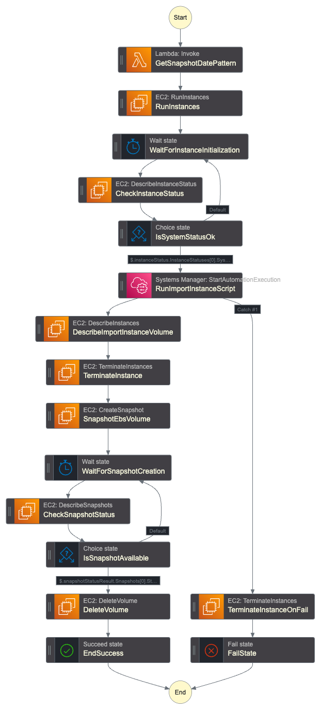

# Ephemeral MySQL
The templates described in this README will provide the ability to create ephemeral Aurora Clusters or Ephemeral EBS volumes that can be used for ECS MySQL tasks.

# Usage (Ephemeral Aurora V2 Serverless)

Deploy the `ephemeral-db-import-rds.yml` Step Function template


Use the `aurora-serverless-v2.yml` template and pass in the `SnapshotIdentifier` for the snapshot that the Step Function template creates after a successful run.

This will create a net-new Aurora Serverless V2 Cluster with its password managed by Secrets Manager.

Now, you can create as many ephemeral Aurora Clusters as you want.

> [!Note]
> If you update the `aurora-serverless-v2` stack and make modifications to `SnapshotIdentifier` please be aware of the following:
> If you specify a property that is different from the previous `SnapshotIdentifier` restore property, a new DB cluster is restored from the specified `SnapshotIdentifier`, and the original DB cluster is deleted. 
> if you don't specify the SnapshotIdentifier property, an empty DB cluster is created, and the original DB cluster is deleted.
> See the [AWS Documentation](https://docs.aws.amazon.com/AWSCloudFormation/latest/UserGuide/aws-resource-rds-dbcluster.html) for more details.


# Notables

1. The `ephemeral-db-import.yml` stack currently is hardcoded to use MySQL 8.0 and a database dump bucket.
> These values will need to be changed accordingly. Before the import script, the aurora db also has the following databases created: `tophat magento inventory`

2. Both templates use the `ManageMasterUserPassword` flag, which uses Secrets Manager to manage the database credentials. This allows us to have a rotatable password that we don't have to manage.
> When you restore a snapshot with this flag, it no longer uses the password tied to the snapshot at the time of creation. Now, it will use Secrets Manager to have a new, rotatable password.


# Usage (Ephemeral EBS volumes)

## Step Functions Workflow
<p align="center">
  
</p>

Deploy the `ephemeral-db-import-ebs.yml` Step Function template

The Step Function is ran on a schedule. This schedule is defined under the `Resources.MySQLImportStateMachine.Events.Schedule` block as shown below:

```yml
Resources:
    ...

    MySQLImportStateMachine:
      ...
      Events:
        CronSchedule:
          Type: Schedule
          Properties:
            Schedule: cron(59 23 * * ? *)
            Enabled: True
```

## Snapshot retention
This template also deploys a Lambda function used to expire old snapshots to save on AWS costs. The code for this Lambda is located under [/lambdas/cleanUpOldSnapshots/app.py] 

To change how many snapshots are retained when the function triggers, modify the following parameter inside the `template.yml` file and then re-deploy this template.


The Step Function that is included in this template will run an EC2 instance that has another EBS volume mounted at `/var/lib/mysql`.
It will perform these functions:

1. Launch an EC2 instance
2. Install and run MySQL server and create a user that allows connections to it from any IP
3. Mounts the `/dev/nvme1n1` secondary EBS volume to `/var/lib/mysql`
4. Downloads MySQL dump from S3, create the necessary databases that this dump uses, and imports the dump.
5. Snapshot the `/var/lib/mysql` EBS volume, terminate the EC2 instance, and delete the EBS volume now that there is a snapshot of it.

The purpose of this is so that we can use the snapshot of this EBS volume for ECS fargate MySQL containers. (See `ebs-at-launch-fargate-mysql.yml` for an example of this.)


# Deploying

```bash
sam build -t ephemeral-db-import-ebs.yml

sam deploy -t ephemeral-db-import-ebs.yml \
    --resolve-s3 \
    --capabilities CAPABILITY_NAMED_IAM \
    --confirm-changeset \
    --stack-name MySQLEphemeralSnapshotStateMachine
```